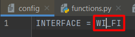
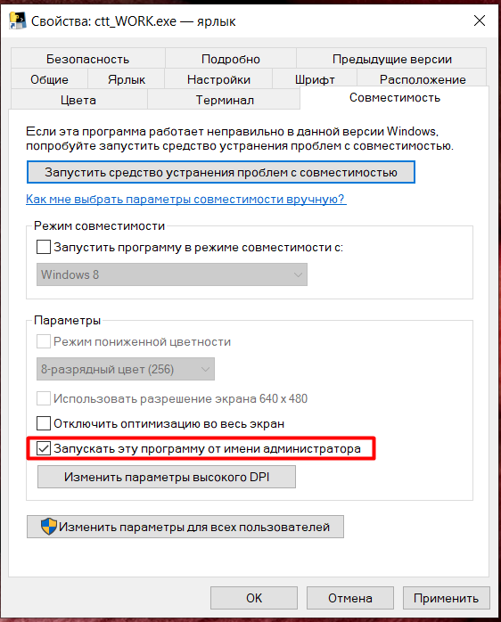
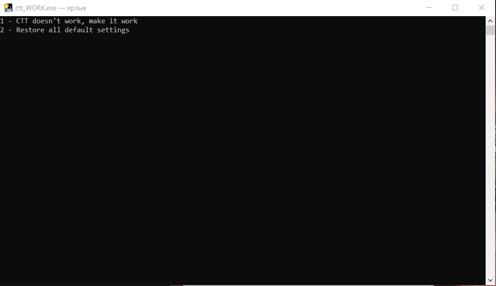

# Настройка тулзы

1. Переименовать файл config_example в config
2. В config вместо *** указать свой сетевой интерфейс  
3. Тулзу нужно запусакть от имени администратора (чтобы она всегда запускалась от имени администратора, нужно открыть
   свойства ctt_work_tools.exe и в пункте совместимость поставить галочку напротив Запускать это программу от имени
   администратора .
4. После запуска тулзы нужно ввести с клавиатуры режим работы 1 или 2 .

# Принцип работы тулзы

### Режим работы №1

1. Тулза убивает все процессы связанные с СTT.
2. Если в сетевом унтерфесе был установлен DHCP, то переходит в ручной режим, если был выключен DHCP, то сменяет ip
   адресс на следующий.

### Режим работы №2

1. Тулза убивает все процессы связанные с СTT.
2. Возвращает сетевые настройки в DHCP

### БОНУС

Подключаемся к VPN -> запускаем тулзу -> выбираем пункт 1 -> запускаем CTT. Наслаждаемся рабочим процессом!